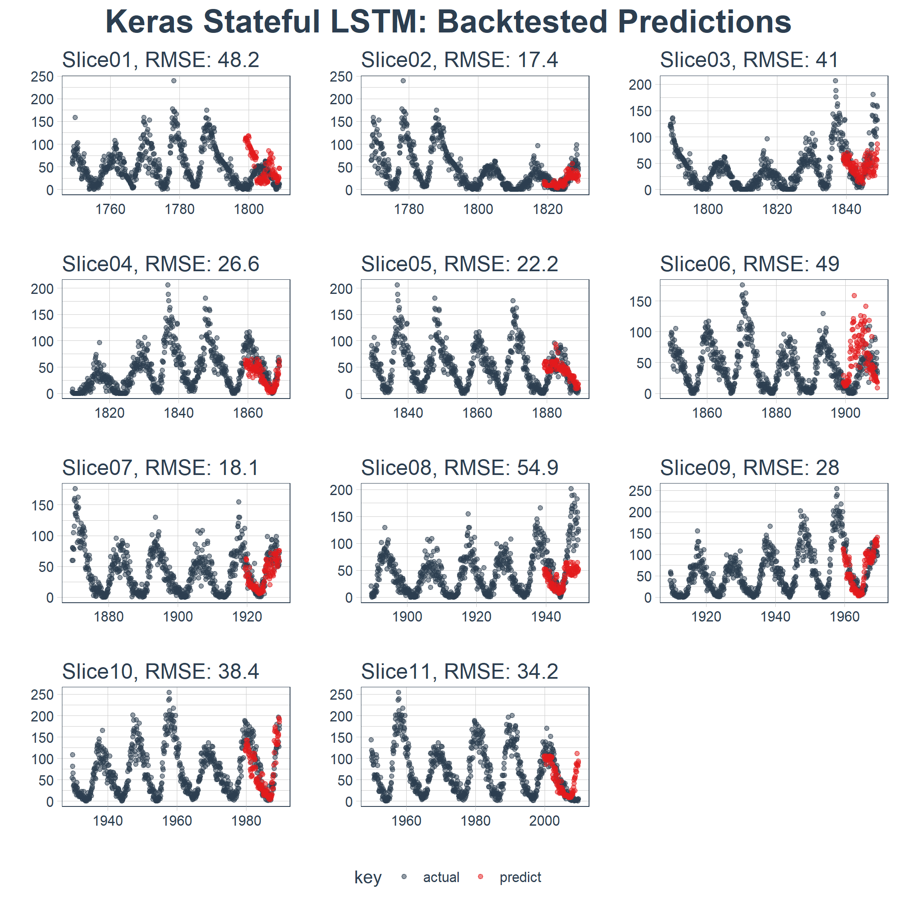

Time Series Deep Learning
================

  - This slide deck on Time Series Deep Learning was presented at S\&P
    Global’s headquarters on April 19th, 2018.

  - The presentation accompanies the [Business
    Science](http://www.business-science.io) blog article, [“Time Series
    Deep Learning: Forecasting Sunspots With Keras Stateful LSTM In
    R”](http://www.business-science.io/timeseries-analysis/2018/04/18/keras-lstm-sunspots-time-series-prediction.html).

