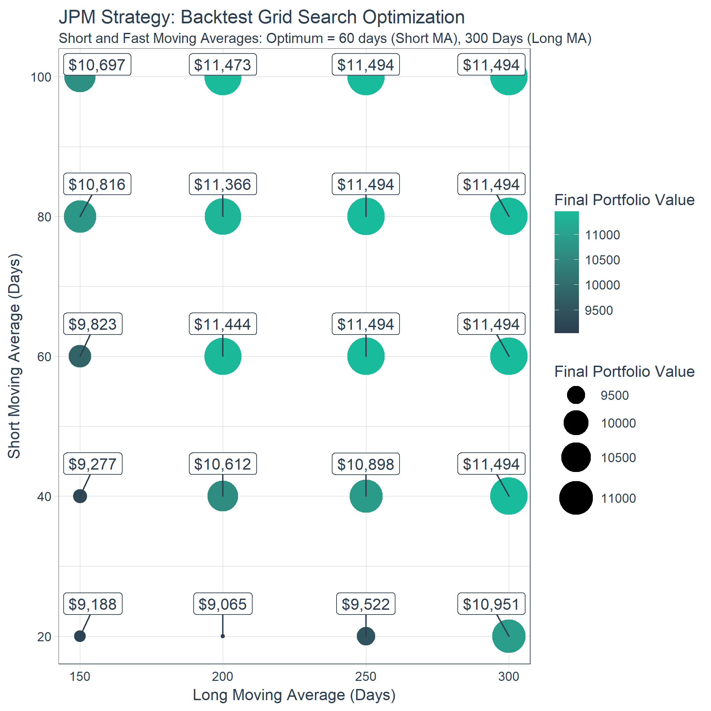
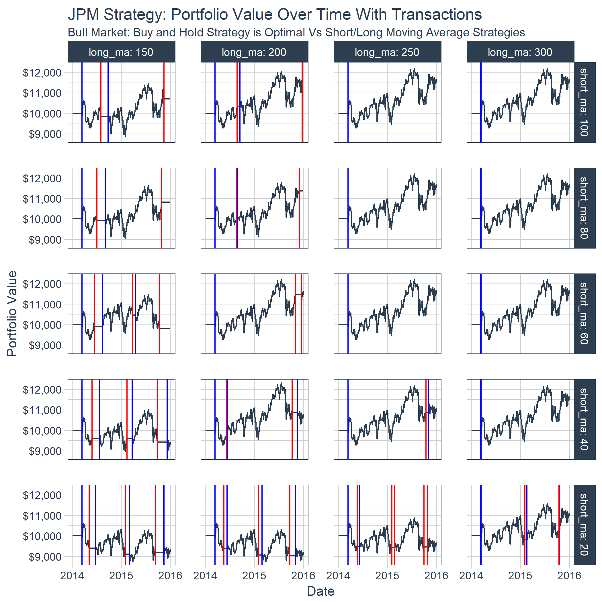

A Time Series Platform For The Tidyverse
================

-   This slide deck on "A Time Series Platform For The Tidyverse" was presented at R/Finance on June 1st, 2018.

-   The presentation accompanies the [Business Science](http://www.business-science.io) blog article, ["Algorithmic Trading: Using Quantopian's Zipline Python Library in R and Backtest Optimizations by Grid Search and Parallel Processing"](http://www.business-science.io/business-science-labs/2018/05/31/backtesting-quantopian-zipline-tibbletime-furrr-flyingfox.html).

Grid Search Optimization For Trading Algorithm

Portfolio Value Over Time

