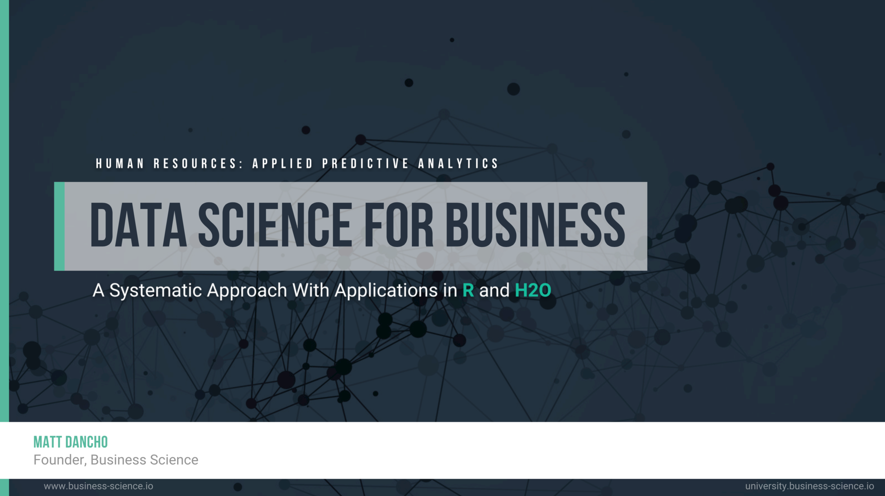
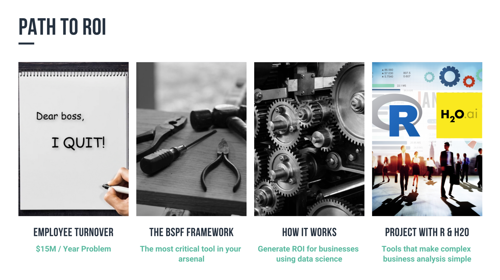
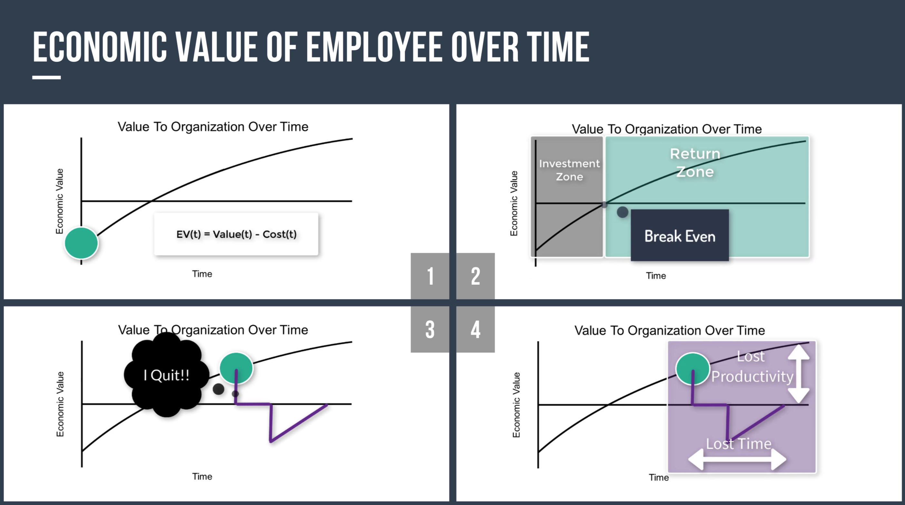
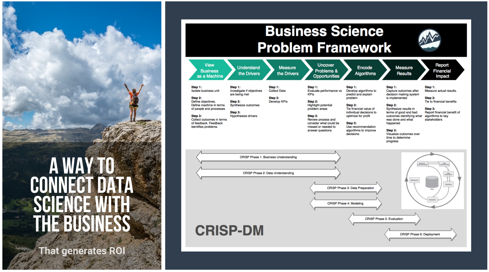
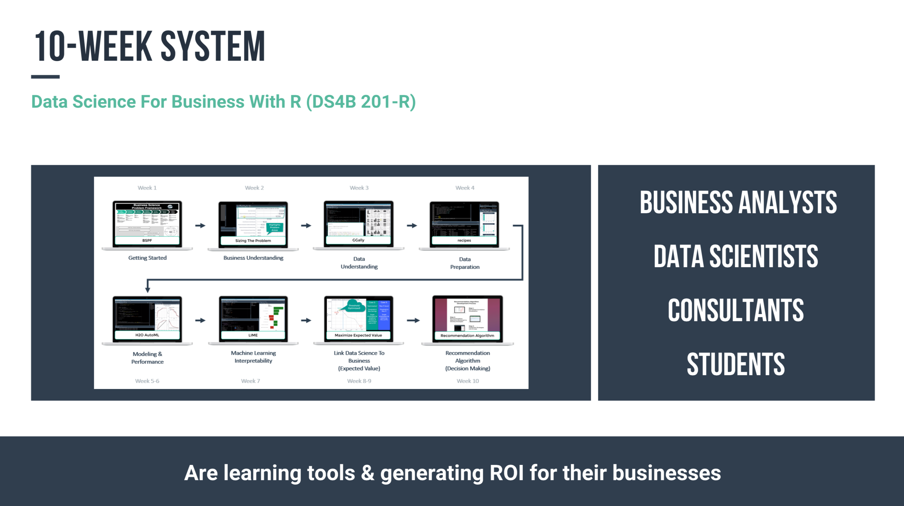

DataScienceGO 2018: Business Science Problem Framework
================

***The path to Return-On-Investment with Data Science\!***

-----

## The Presentation

**Ever wonder how to connect data science with the business?**

Then look no further. This presentation covers the essential project
management framework that’s designed to systematically ***generate ROI
from data science.***

-----

## The Agenda

-----

## The Problem

You’ll walk through an employee turnover
problem.

-----

## The Solution

-----

## Learning More

<a href="https://university.business-science.io/p/hr201-using-machine-learning-h2o-lime-to-predict-employee-turnover">
 <a>

Take the course that’s transforming data scientists:

  - In 10-Weeks, learn the process for generating ROI

  - Solve and end-to-end data science project

  - Learn `R` and `H2O`

  - Get results\!

[**Join Data Science For Business With R
Now\!**](https://university.business-science.io/p/hr201-using-machine-learning-h2o-lime-to-predict-employee-turnover)
