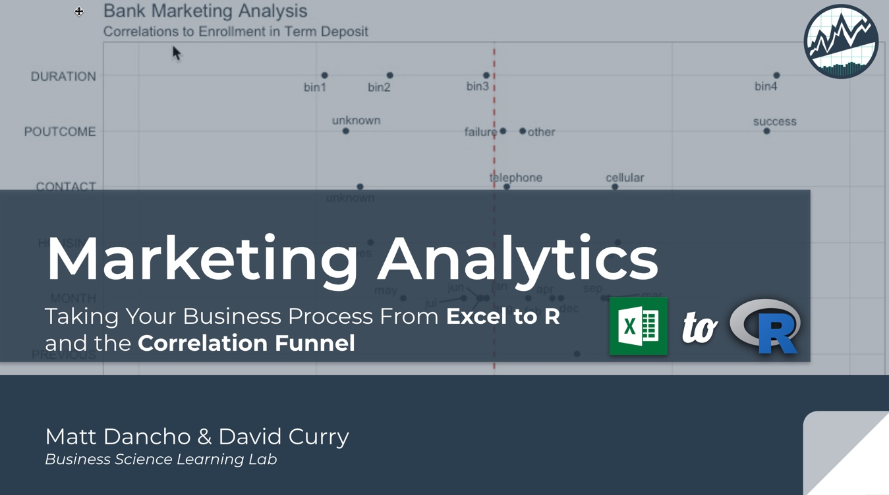

<!-- README.md is generated from README.Rmd. Please edit that file -->

```{r setup, include = FALSE}
knitr::opts_chunk$set(
  collapse = TRUE,
  comment = "#>"
)
```
# Learning Lab #3: Marketing Analytics

This repo includes the:

- [Excel Data](https://github.com/business-science/presentations/tree/master/2019_02_13_Learning_Lab_Marketing_Analytics/data)
- [`R code`](https://github.com/business-science/presentations/blob/master/2019_02_13_Learning_Lab_Marketing_Analytics/marketing_analysis.R) and [Rmd Report](https://github.com/business-science/presentations/blob/master/2019_02_13_Learning_Lab_Marketing_Analytics/marketing_analysis_report.Rmd)
- [Slide Deck](https://github.com/business-science/presentations/blob/master/2019_02_13_Learning_Lab_Marketing_Analytics/Excel_To_R.pdf)
- [PDF Report](https://github.com/business-science/presentations/blob/master/2019_02_13_Learning_Lab_Marketing_Analytics/marketing_analysis_report.pdf)

and other presentation materials for __Business Science Learning Lab #3: Marketing Analytics - Taking You Business Process from Excel to R and the Correlation Funnel__. 

```{r}

```

