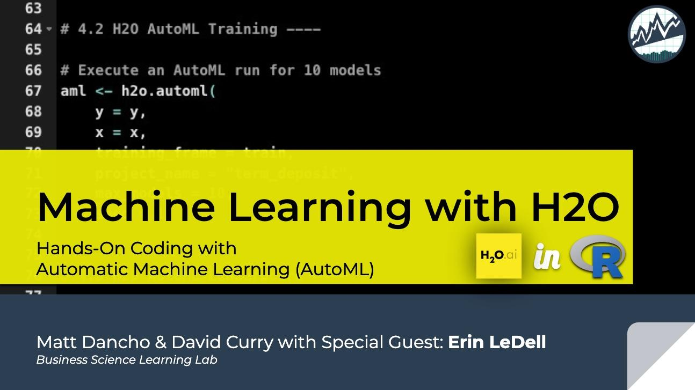

<!-- README.md is generated from README.Rmd. Please edit that file -->

# Learning Labs \#3 & \#4 - Marketing Analytics, Corr Funnel, H2O Automatic Machine Learning 

## Learning Lab \#3: Marketing Analytics

[Watch on YouTube](https://youtu.be/VSjU_4XoMAM)

Key Files:

  - [Excel
    Data](https://github.com/business-science/presentations/tree/master/2019_02_13_Learning_Lab_Marketing_Analytics/data)
  - [`R
    code`](https://github.com/business-science/presentations/blob/master/2019_02_13_Learning_Lab_Marketing_Analytics/marketing_analysis.R)
    and [Rmd
    Report](https://github.com/business-science/presentations/blob/master/2019_02_13_Learning_Lab_Marketing_Analytics/marketing_analysis_report.Rmd)
  - [Slide
    Deck](https://github.com/business-science/presentations/blob/master/2019_02_13_Learning_Lab_Marketing_Analytics/Excel_To_R.pdf)
  - [PDF
    Report](https://github.com/business-science/presentations/blob/master/2019_02_13_Learning_Lab_Marketing_Analytics/marketing_analysis_report.pdf)

and other presentation materials for **Business Science Learning Lab
\#3: Marketing Analytics - Taking You Business Process from Excel to R
and the Correlation Funnel**.

<!-- -->

## Learning Lab \#4 - H2O Automatic Machine Learning

[Watch on YouTube](https://youtu.be/7Cusb3B8jcM)

Key Files:

  - [Excel Data](https://github.com/business-science/presentations/tree/master/2019_02_13_Learning_Lab_Marketing_Analytics/data)
  - [`R` Code (H2O AutoML)](https://github.com/business-science/presentations/blob/master/2019_02_13_Learning_Lab_Marketing_Analytics/marketing_h2o_automl.R)
  - [Slide Deck (H2O)](https://github.com/business-science/presentations/blob/master/2019_02_13_Learning_Lab_Marketing_Analytics/h2o_automl_bizsci_feb2019.pdf)
  

